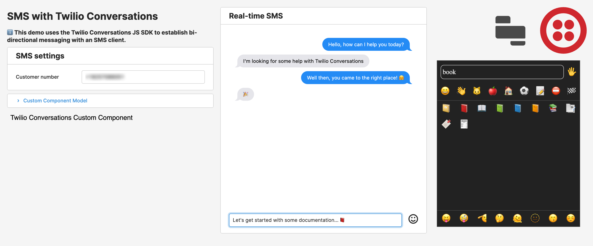

# Twilio Conversations

## Overview
This applet demonstrates how to embed Twilio Conversations in a Retool app to enable bi-directional chat with an SMS client. The app requires an SMS-enabled phone number which you must register with Twilio in order to test.

This serves as an example of how to use Retool [custom components](https://docs.retool.com/docs/custom-components) to add advanced functionality to your apps. You'd need to extensively modify the parts outside of the custom component to use it for anything real!

If you'd just like a guided tour of how the applet works, check out our [video walkthrough](). Otherwise, read on to learn how to set it up in your own environment!

## Who is this for?
This applet will be most interesting for developers who are familiar with the core concepts of building Retool apps and are looking to take the next step with custom components.

If you're just getting started with Retool, check out [Retool University](https://docs.retool.com/docs/retool-university)!

## Setting up the app
To send and receive messages from your Retool app, you'll first need to get up and running with Twilio:

[Twilio Setup](./docs/twilio-setup.md)

Once you've gotten Twilio set up, follow these steps to get it all working in Retool:

[Retool Setup](./docs/retool-setup.md)

## How to contribute
Please open a Github Issue on this repo, and let us know about your interest in contributing! We encourage you to reach out before you get started building to get early feedback.
