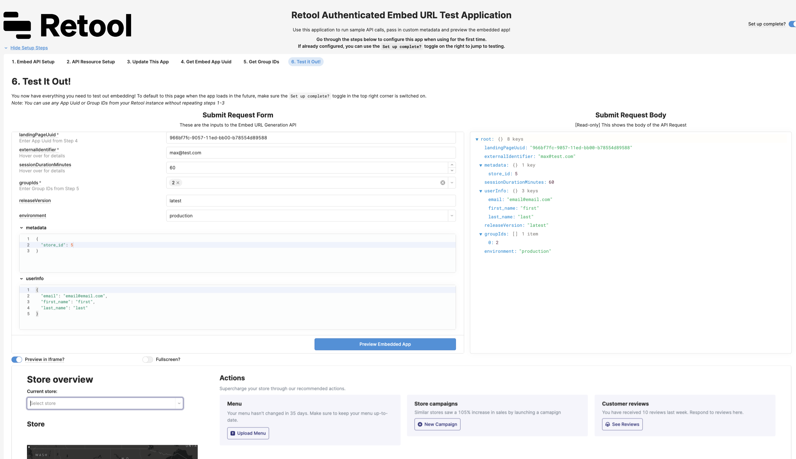
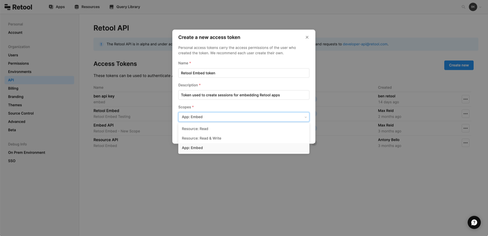
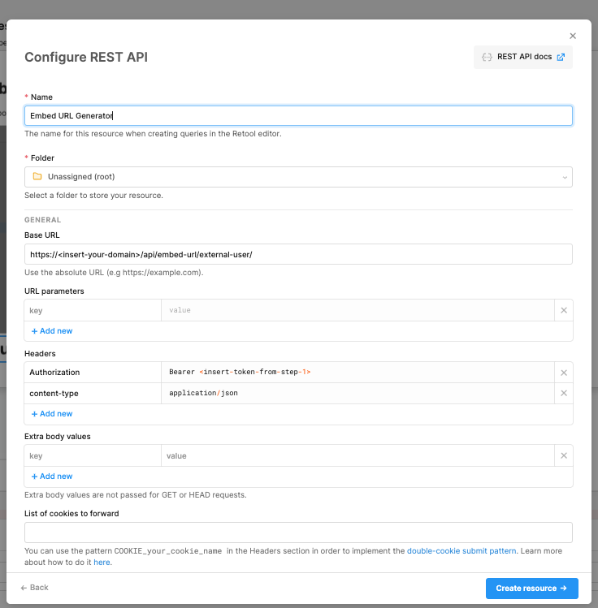
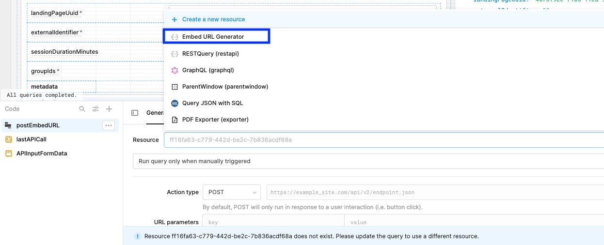
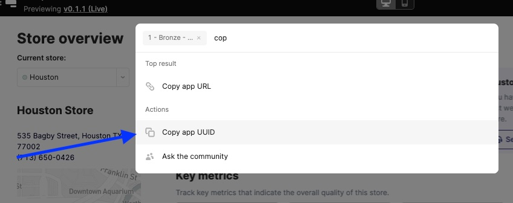
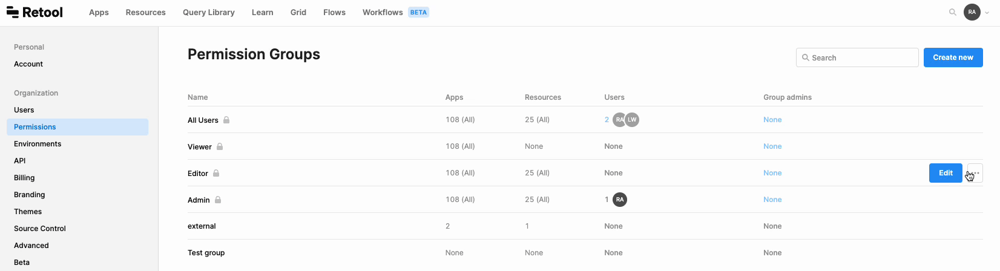

# Embed URL Generator / Embedded App Tester

If you are using [Retool Embed](https://docs.retool.com/docs/retool-embed), we've created a Retool application that lets you preview how your embedded Retool app will look and behave within your parent application.

**Note**: We recommend using this application in *Incognito Mode* in your browser, to prevent conflicts between the sample embedded user and your original Retool login. We also recommend reading the docs linked above before using, especially the parts about passing in [metadata.](https://docs.retool.com/docs/embed-retool-apps#control-access-and-app-behavior-with-metadata)

## Setup
The instructions below are outlined within the Retool application. You can import the app and continue in Retool, or follow along below. Once set up, skip to Step 6 to begin using the application.

### 0. Make sure you have the proper flags enabled

This is only for customers who have [Retool Embed](https://retool.com/products/embed) enabled. If you don't have it, but are interested in learning more, use [this link](https://retool.com/products/embed) to book a demo with our team.

### 1. Set up API with Embed Scope

You'll need to create a Retool API token with the `Embed ` Scope. You can access this page by going to your `settings`. Note that you must be an Admin on your instance to set this up. See screenshot below and link to our documentation [here](https://docs.retool.com/docs/embed-retool-apps#1-generate-an-access-token). Save the token to use in the next step.

## 2. Connect the Retool API as a Resource

1. Navigate to the `/resources` page in your instance and click "Create a new resource" 
2. Select REST API as the resource type
3. Name the resource “Embed URL Generator”
4. Insert per the below screenshot, updating `<insert-your-domain>` with your Retool domain (eg retool.yourdomain.com) and `<insert-token-from-step-1>` with the token from the prior step:

Save the resource, and it should be available for use by your apps. 

### 3a. Download app code
Download the app code from the `/code` directory in this repository.

To do this, clone this Github repo: `git clone https://github.com/tryretool/retool-app-exchange.git` 

(Alternatively, you can manually download `embed_url_generator.json` from the [`code/`](../code) directory.)

### 3b. Import the app code
On the [Retool main page](https://docs.retool.com/docs/protected-applications-getting-started#importing-the-application), click `Create new` and select `Import an app`. Upload the JSON file containing the app code, and name the app.

### 3c. Rewire the Resource for the postEmbedURL query
Within the app, update the `postEmbedURL` query to point at the resource you created in Step 2. See screenshot below:

### 4. Get App UUID
Now the Embed URL generator application is set up. To test out embedding an app, we need to find another application within your instance you'd like to use. Navigate to that other application and grab the UUID by either copying it from your app URL or by using the [command palette](https://docs.retool.com/docs/command-palette). See screenshot below for the command palette:

### 5. Get Group ID
Now that we have an app to embed, we need to pass in a Retool permission group to the API call. You can either use an existing group or create a new group. To learn more about permission groups and how they work with embedded apps, see our docs [here](https://docs.retool.com/docs/embed-retool-apps#2-create-permission-groups-for-your-users). 

### 6. Use the app! 
Now we are ready to test out embedded apps! You can use the form on the left of the app under `Submit Request Form` to input different parameters, the JSON on the right under `Submit Request Body` is a preview of what is getting passed to the API in the body, and below the form you can toggle "Preview in Iframe" on to show the app in an iframe below the page, or keep it off to provide the generated embed URL as a link. 

**Note**: Once you have gone through these steps, toggle in the `Setup Complete` tab in the top right of your applciation to navigate to that testing step automatically in the future.

## How to contribute
Please open a Github Issue on this repo, and let us know about your interest in contributing! We encourage you to reach out before you get started building to get early feedback.
