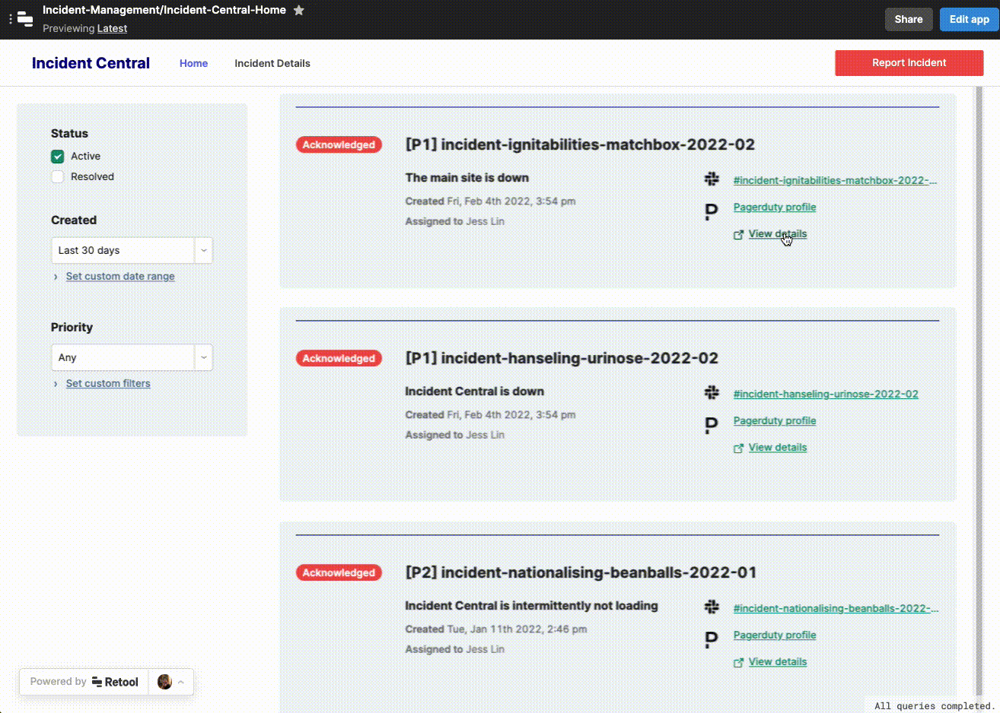
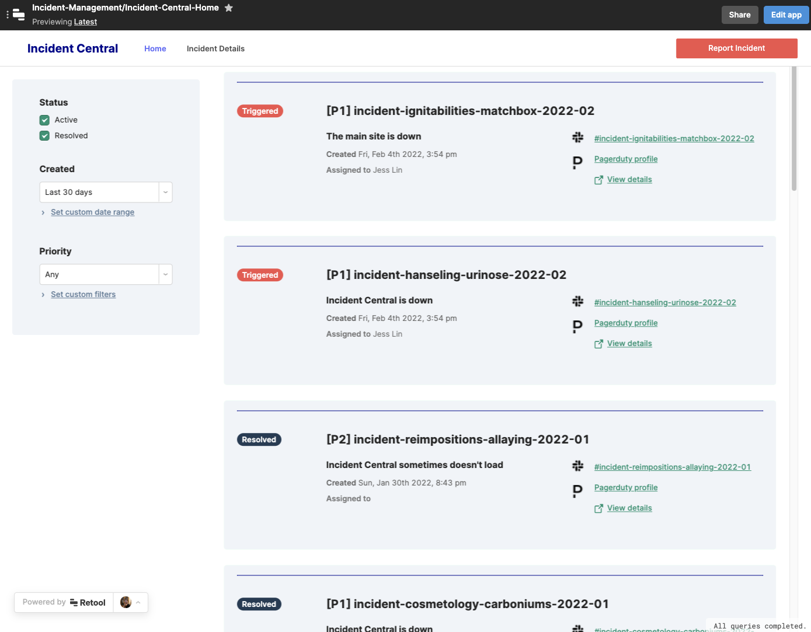
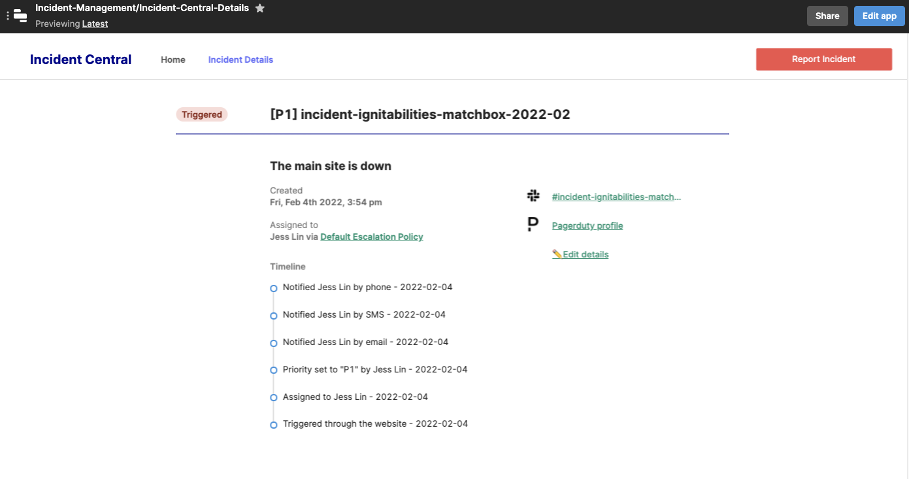
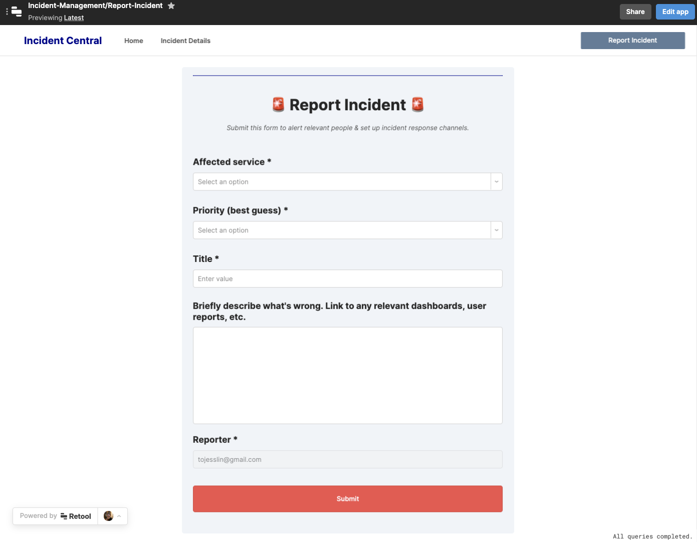
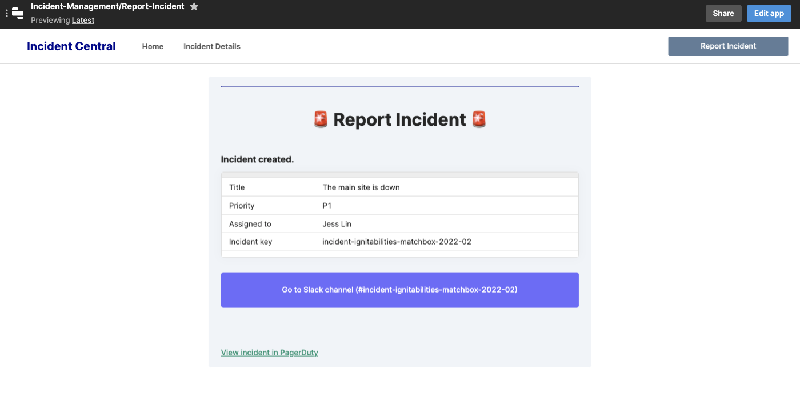

# Incident Central - An incident response hub for engineering teams

## Why you need this
In any engineering organization, things will go wrong. No matter what kind of product you're building, what size you are, or how hard you try, something will break.

You'll want to develop a robust incident response process, as well as supporting tools to empower people to use the process. For example, a tool can make it easy to report an incident, alert the right people to respond, and give responders a communication channel to collaborate to solve the problem.

In addition, you want to be able to get a bird's-eye view of incidents—one place you can go to see a list of all open incidents. You also want to be able to find past incidents, in order to review them, reflect on them, and improve.

## What does Incident Central do?
Incident Central is a ready-made app that lets you do these things:
1. Anyone at your company (engineer or not) can report an incident via a simple user interface. When an incident is reported through Incident Central, the following things will happen:
    - A unique human-readable incident name will be generated for the incident.
    - The PagerDuty on-call rotation for the problematic service will be triggered, thus alerting the on-call.
    - A Slack channel for incident response will be created.
    - The information above about the incident will be written to a database that you provide, so that you have a means to look up current and past incidents.

2. You can see all open incidents, and quickly navigate to the relevant incident Slack channel.
3. You can drill into a specific incident, and edit its metadata.

In addition, you can build out any other incident-related functionality you want. (For example, you might decide that you want to also create a Jira ticket every time an incident is opened.)

In the future, we will likely add a page that displays aggregate incident metrics. Stay tuned.

## Screenshots
<table>
  <tr>
    <td valign="top"></td>
    <td valign="top"></td>
  </tr>
  <tr>
    <td valign="top"></td>
    <td valign="top"></td>
  </tr>
</table>

### Who is this tool for?
You likely want everyone (or most people) at your company to be able to report an incident. Thus, the Report Incident UI within Incident Central is designed to be used by anyone at your company.

Members of the engineering team will likely use the other functionality: looking up, editing, and reviewing incident data.

### Where does this tool fits into the incident response process?
There are five main steps in an incident management process [0]:
1. Triage
2. Coordinate
3. Mitigate
4. Resolve
5. Follow-Up

In Incident Central, the "Report Incident" UI will help kick off Step 1: "Triage", by alerting the right people. It will also set up a communication channel for people to do Step 2: "Coordinate."

During an incident ("Coordinate"-"Resolve"), people can go to Incident Central to find the link to the incident communication channel and other metadata.

After an incident, you can use Incident Central to look up information about the incident, as part of Step 5: "Follow-Up."

## Technical Details and Setup
### Dependencies - backends
The initial version of Incident Central depends on the following backend services:
* Slack
* PagerDuty
* A database (e.g. PostgreSQL or MySQL)

You are welcome to adapt Incident Central to an alternative backend (for example, perhaps Microsoft Teams instead of Slack). We encourage you to submit your modified version of the app here for others to use. See the **"How to contribute"** section below.

### How to set up Incident Central in your Retool instance
See the detailed setup guides in the [Setup Guides folder](./setup-guides).

As an overview, these guides will take you through:

1. Setting up backend dependencies.
    - Configuring your Slack and PagerDuty instances.
    - Creating a relational database, if you don't have one already.
2. Setting up these backends as Resources in Retool.
3. Downloading and configuring the Retool app files.

## What's next?
### Ideas for extending this app
* Do you use a different chat application instead of Slack? You can swap the Slack REST API calls in this app for calls to your chat application instead.
* Do you want other things to happen when someone reports an incident? (Perhaps, you want a Jira ticket to be created, and a Google Doc to be spun up?) You can extend the Report Incident page to also do these things (e.g. by adding calls to Jira and Google APIs.)

### How to contribute
Please open a Github Issue on this repo, and let us know about your interest in contributing! We encourage you to reach out before you get started building to get early feedback.

## Appendix

### Learn more about incident response process and tooling
As part of the research in building this app, we interviewed an engineer who built incident response tools at Stripe. Check out the blog post: [From checklist to service: scaling Stripe’s incident response](https://retool.com/blog/incident-response-tools-stripe/)

### Citations
[0] Five main steps in an incident management process: [Increment magazine](https://increment.com/on-call/when-the-pager-goes-off/)
