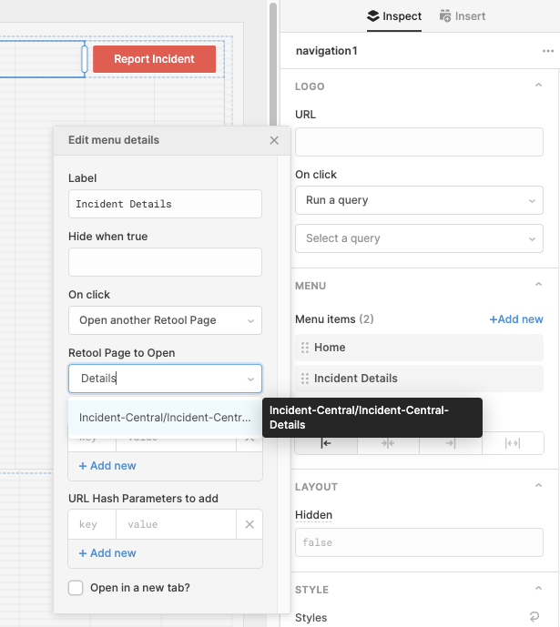
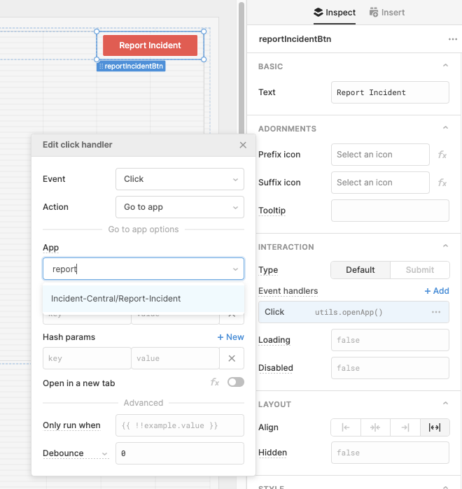
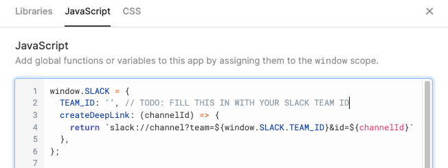

# Incident Central Setup - Step 5: Apps in Retool

## What's an App in Retool?
As the name suggests, an App is a single "view" (or "page") that you can build in Retool. An App is built from a combination of Components to construct the UI, and Queries that define calls to your Resources. Queries can do reads or writes.

## Why Incident Central is 3 Retool Apps

To the end-user, Incident Central looks like a single, unified website. However, under the hood, it is 3 distinct Retool Apps.

This is because Incident Central consists of three distinct "views", and I have chosen to make these views independent of each other, so that it's easy for anyone (including me!) to mix and match them and refactor them. Decoupling unrelated pieces of functionality is in general a good practice in programming.

The three distinct Retool Apps are: a home page, an incident details view, and a Report Incident view.

These three Apps are united by one common Navigation bar (implemented as a reusable [Module](https://docs.retool.com/docs/modules)) that sits in the header. This Navigation bar lets the end-user experience Incident Central as a single, unified website.

## Output
The goal of this section is:
* To get Incident Central into your Retool instance. 🚀


## Step 5.1 - Download the app "code"
Go to the `/code` directory in this Github repo, and download the pieces of code there.

The fastest way to do this is to git-clone this Github repo:
`git clone <>`
(You can also manually click-to-download each file.)

You will have the following files:

```
- Incident-Navbar.json
- Incident-Central-Home.json
- Incident-Central-Details.json
- Report-Incident.json
```

## Step 5.2 - Import the app "code"
First, let's create a folder to put all of this code into, to keep things organized.
1. On your Retool home page, click "Create new" → "Create a new folder". Give this folder a name you like, e.g. "Incident-Central".

Now, let's import the Navigation bar Module.
2. Click "Create new" → "Import an app". Upload the `Incident-Navbar.json` file, and select the folder you just created ("Incident-Central") as the destination.

Now, let's import each app.
3. For each of the three app files (`Incident-Central-Home.json`, `Incident-Central-Details.json`, `Report-Incident.json`), do these steps:
    * Click "Create new" → "Import an app".
    * Upload the file, and select the folder you just created ("Incident-Central") as the destination.


## Step 5.3 - Adjust links in the navigation bar
Finally, let's hook up the links to our apps in the `Incident-Navbar`.
4. Go to the "Incident-Central" folder. Click the "Edit" button to the right of the `Incident-Navbar` Module to open the editor view.
5. Within the UI editor canvas, click on the 'navigation' component on the screen. You should see the details of this component appear in the right-hand sidebar.
6. Look in the right-hand sidebar for the "Menu items" detail, with "Home" and "Incident Details" listed. Click on each of these menu items, and adjust its "App to Open" to be the appropriate app.
<br/>

7. Now, within the UI editor canvas, click on the "Report Incident" button component.
8. Look in the right-hand sidebar for the "Event handlers" detail. Click on the one event handler, and adjust the "App" that will be opened.
<br/>

## Step 5.4 - Fill in your Slack Team ID
There is one place in Incident Central where we use your Slack Team ID as a hardcoded value. This is the simplest way to get this value (which in most cases stays the same).

9. Open the "Report-Incident" app in Editor mode.
10. Click the "..." button in the upper right. Select "Scripts and styles" from the dropdown.
11. A modal will open. Select the "JavaScript" tab.
12. At the top of the code here, you'll see a place to fill in your Slack Team ID as a constant.
<br/>
13. Click "Save".

## Step 5.5 - Test it out
In this section, we're going to test out the functionality in your new apps. Ideally, put yourself oncall for whichever service you want to send a test "incident" to in PagerDuty, so that you don't surprise someone else! (Or else, give the person who's oncall a heads-up that you are testing.)

Navigate to your "Incident-Central" folder, and click on the "Report-Incident" app. Choose a service to create a "test" incident for, and fill out the form. This should:
- Page the person who is oncall via PagerDuty.
- Create a Slack channel and add you and the oncall person to it.

Now, click on the "Home" menu item in the navbar to open the Incident Central "Home" page. You should see the new incident listed.

Now, click on "View details" for this incident. You should see the details view load for this incident.


## Summary

You should now have Incident Central within your Retool instance! 🥳

**Next steps:** You can choose to extend or adjust this app in any way. (For example, maybe you'd like Report Incident to also create a Jira ticket.)

Please consider contributing back to this Github repo if you make something you think other people would like to use! Get in touch by opening a Github Issue if you have an idea you want to run by us.

**Questions, comments, feedback?** Please open a Github Issue and let us know!
