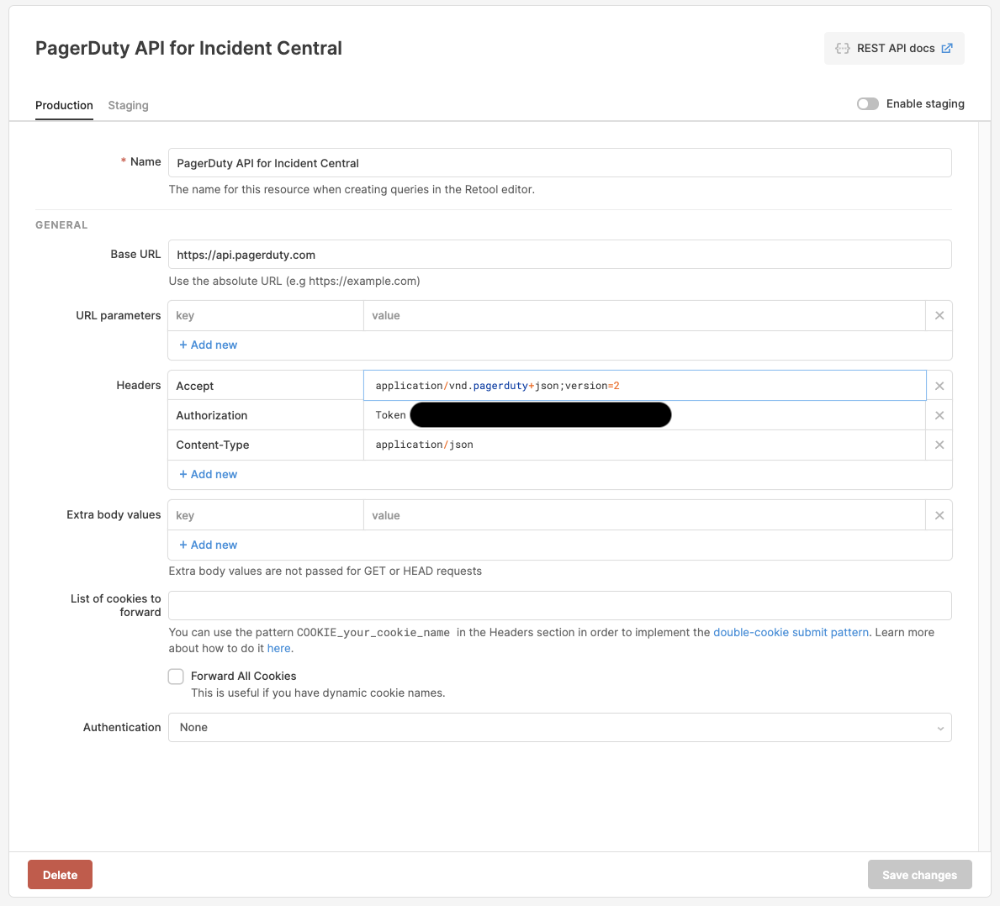
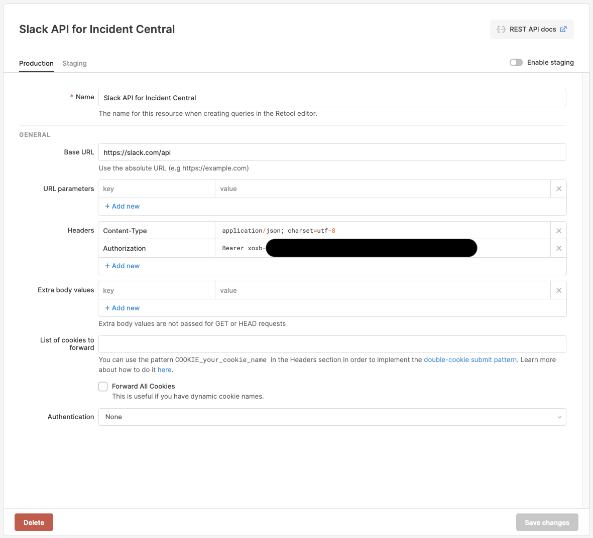

# Incident Central Setup - Step 4: Resources in Retool

## What's a Resource in Retool?
A Resource is a core concept in Retool. A Resource is a config that defines a backend data source that your Retool apps can talk to. Retool supports a variety of different kinds of backends, from databases to REST API calls, to special integrations like Stripe.

You can define a Resource once, then use it again and again in your Retool apps.

Read more about Resources in [the Retool docs](https://docs.retool.com/docs/integrations-overview).

## Output
The goal of this section is to create:
* A Resource called `PagerDuty API for Incident Central`. This will be a reusable way to call the PagerDuty API that you set up in Step 1.
* A Resource called `Slack API for Incident Central`. This will be a reusable way to call the Slack API that you set up in Step 2.
* A Resource called `Incident Database`. This will be a reusable way to query the database that you set up in Step 3.

Note: The names here are important! The app code we provide expects the Resources to have these names. (You can choose to rename them, after you've finished setting everything up.)

## Step 4.1 - Create the "PagerDuty API for Incident Central" Resource
1. On the Resources page (`/resources`) in Retool, click "Create New" in the upper right.
2. Select the "REST API" resource type.
3. Fill out the resource information as follows:

```
Name: PagerDuty API for Incident Central
Base URL: https://api.pagerduty.com
```

```
= Headers =
Accept: application/vnd.pagerduty+json;version=2
Authorization: Token token=<your token>
Content-Type: application/json
```
4. Click "Save changes".




## Step 4.2 - Create the "Slack API for Incident Central" Resource
1. On the Resources page (`/resources`) in Retool, click "Create New" in the upper right.
2. Select the "REST API" resource type.
3. Fill out the resource information as follows:

```
Name: Slack API for Incident Central
Base URL: https://slack.com/api
```

```
= Headers =
Content-Type: application/json; charset=utf-8
Authorization: Bearer <your token>
```
4. Click "Save changes".




## Step 4.3 - Create the "Incident Database" Resource
1. On the Resources page (`/resources`) in Retool, click "Create New" in the upper right.
2. Select the "Postgres" resource type. (Or, if you've used a different type of database, select the appropriate type.)
3. Fill out the resource information as follows. (For more info, see [our docs on Postgres integration](https://docs.retool.com/docs/postgresql-integration).)

```
Name: Incident Database

<if needed, see our docs for more info on each of these fields>
Host:
Port:
Database name:
Database username:
Database password:
```

4. Click "Save changes".


## Summary
You now have three Resources defined in Retool, with the following names:
* `PagerDuty API for Incident Central`
* `Slack API for Incident Central`
* `Incident Database`

Reminder: The names here are important! The app code we provide expects the Resources to have these names. (You can choose to rename them, after you've finished setting everything up.)

Now, we are ready to import our apps!

## Next step
[Step-by-step: Set up Retool Apps](./set-up-retool-apps.md)
