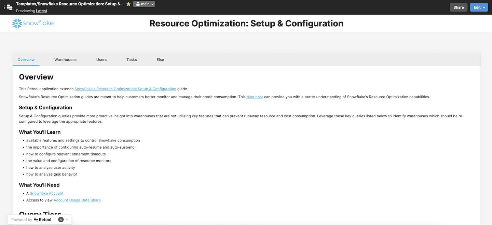

# Snowflake Resource Optimization: Setup & Configuration

## Why you need this
This Retool app extends [Snowflake's Resource Optimization: Setup & Configuration Quickstart Guide](https://quickstarts.snowflake.com/guide/resource_optimization_setup/index.html?index=..%2F..index#0).

The Resource Optimization Quickstart Guides are meant to help customers better monitor and manage their credit consumption. Setup & Configuration queries provide more proactive insight into warehouses that are not utilizing key features that can prevent runaway resource and cost consumption. Leverage these key queries to identify warehouses which should be re-configured to leverage the appropriate features.

Retool builds on the Quickstart Guide by enabling you to take action from right within the tool - set auto-suspend or auto-resume for your warehouses, suspend or drop idle warehouses, disable or drop idle users, etc.

## What does Snowflake Resource Optimization: Setup & Configuration do?
Snowflake Resource Optimization: Setup & Configuration is a ready-made app that lets you do these things:
### Warehouses
- Identify warehouses without auto-resume enabled and enable it
- Identify warehouses without auto-suspend enabled and enable it for your chosen duration
- Identify warehouses with long suspension and modify the auto-suspend setting
- Identify warehouses without resource monitors and assign them where needed
- Identify idle warehouses and suspend or drop them
### Users
- Review warehouses used by multiple roles and investigate relevant query metrics
- Identify idle users and disable or drop them
- Identify users who have never logged in and disable or drop them
- Identify idle roles and drop them
### Tasks
- Identify failed tasks and show query history or drop them
- Identify long running tasks and show query history or drop them
### Else
- Review account, warehouse, or user statement timeouts and modify them
- Identify stale table streams and XXX

## Screenshots
<table>
  <tr>
    <td valign="top"></td>
    <td valign="top"></td>
  </tr>
  <tr>
    <td valign="top"></td>
    <td valign="top"></td>
  </tr>
</table>

## Who is this tool for?
This tool will enable users to make irreversible changes, such as dropping warehouses, users, roles, or tasks. It is set up to leverage the [ACCOUNTADMIN](https://docs.snowflake.com/en/user-guide/security-access-control-considerations.html#using-the-accountadmin-role) role, and as such should only be used by Snowflake administrators who are trusted to make such changes.

## Technical Details and Setup
### Dependencies - backends
The Snowflake Resource Utilization: Setup & Configuration app depends on the following backend services:
* Snowflake

### How to set up Incident Central in your Retool instance
See the detailed setup guides in the [Setup Guides folder](./setup-guides).

As an overview, these guides will take you through:

1. Setting up backend dependency.
2. Setting up this backend as a Resource in Retool.
3. Downloading and configuring the Retool app file.

## What's next?
### How to contribute
Please open a Github Issue on this repo, and let us know about your interest in contributing! We encourage you to reach out before you get started building to get early feedback.
