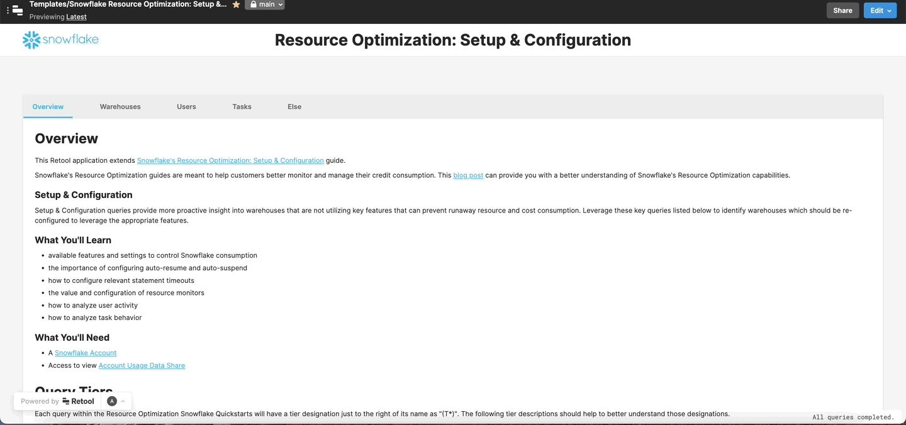
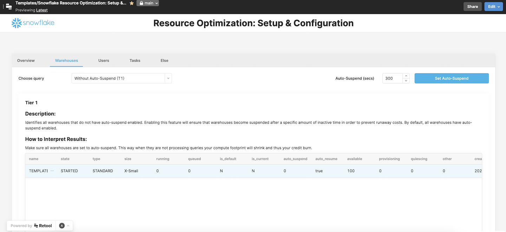
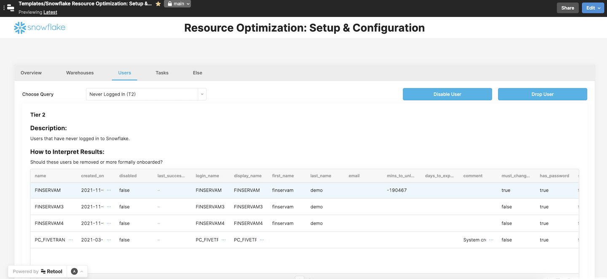
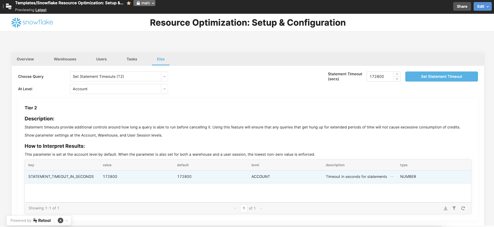

# Snowflake Resource Optimization: Setup & Configuration

## Why you need this
This Retool app extends [Snowflake's Resource Optimization: Setup & Configuration Quickstart Guide](https://quickstarts.snowflake.com/guide/resource_optimization_setup/index.html?index=..%2F..index#0). If you use Snowflake, it will help you better monitor and manage your credit consumption, and avoid spending more than you need to.

This Retool app makes it easy to put the Quickstart Guide into practice, by enabling you to take action from right within an easy-to-use UI. Without having to remember or type any commands, you can set auto-suspend or auto-resume for your warehouses, suspend or drop idle warehouses, disable or drop idle users, etc.

## What does Snowflake Resource Optimization: Setup & Configuration do?
The Snowflake Resource Optimization: Setup & Configuration app lets you do the following things with the click of a button:

### Warehouses
- Identify warehouses without auto-resume enabled and enable it
- Identify warehouses without auto-suspend enabled and enable it for your chosen duration
- Identify warehouses with long suspension and modify the auto-suspend setting
- Identify warehouses without resource monitors and assign them where needed
- Identify idle warehouses and suspend or drop them
### Users
- Review warehouses used by multiple roles and investigate relevant query metrics
- Identify idle users and disable or drop them
- Identify users who have never logged in and disable or drop them
- Identify idle roles and drop them
### Tasks
- Identify failed tasks and show query history or drop them
- Identify long running tasks and show query history or drop them
### Else
- Review account, warehouse, or user statement timeouts and modify them
- Identify stale table streams

## Screenshots
<table>
  <tr>
    <td valign="top"></td>
    <td valign="top"></td>
  </tr>
  <tr>
    <td valign="top"></td>
    <td valign="top"></td>
  </tr>
</table>

## Who is this tool for?
This tool will enable users to make irreversible changes, such as dropping warehouses, users, roles, or tasks. It is set up to leverage the [ACCOUNTADMIN](https://docs.snowflake.com/en/user-guide/security-access-control-considerations.html#using-the-accountadmin-role) role, and as such should only be used by Snowflake administrators who are trusted to make such changes.

## Technical Details and Setup
### Dependencies - backends
The Snowflake Resource Optimization: Setup & Configuration app depends on the following backend services:
- Snowflake

### How to set up Snowflake Resource Optimization: Setup & Configuration in your Retool instance
See the detailed setup guides in the [Setup Guides folder](./setup-guides).

As an overview, these guides will take you through:

1. Setting up Snowflake.
2. Setting up your Snowflake database as a Resource in Retool.
3. Downloading and configuring the Retool app file.

### Application notes
Please find some relevant considerations below:
- In [Snowflake's Resource Optimization: Setup & Configuration Quickstart Guide](https://quickstarts.snowflake.com/guide/resource_optimization_setup/index.html?index=..%2F..index#0), the Idle Users, Users Never Logged In, and Idle Roles queries leverage the [ACCOUNT_USAGE](https://docs.snowflake.com/en/sql-reference/account-usage.html) schema. The Retool app, however, uses Snowflake DDL (e.g. SHOW USERS) to avoid the latency associated with the ACCOUNT_USAGE schema. This means that you are able to review and update users and roles as soon as they are created in Snowflake. It also means that these queries do not show deleted users or roles.
- The Failed Tasks and Long Running Tasks queries can take a long time to run. Feel free to modify them using [Snowflake's recommendations](https://docs.snowflake.com/en/sql-reference/account-usage/task_history.html#usage-notes) as needed.  

## What's next?
### How to contribute
Please open a Github Issue on this repo, and let us know about your interest in contributing! We encourage you to reach out before you get started building to get early feedback.
