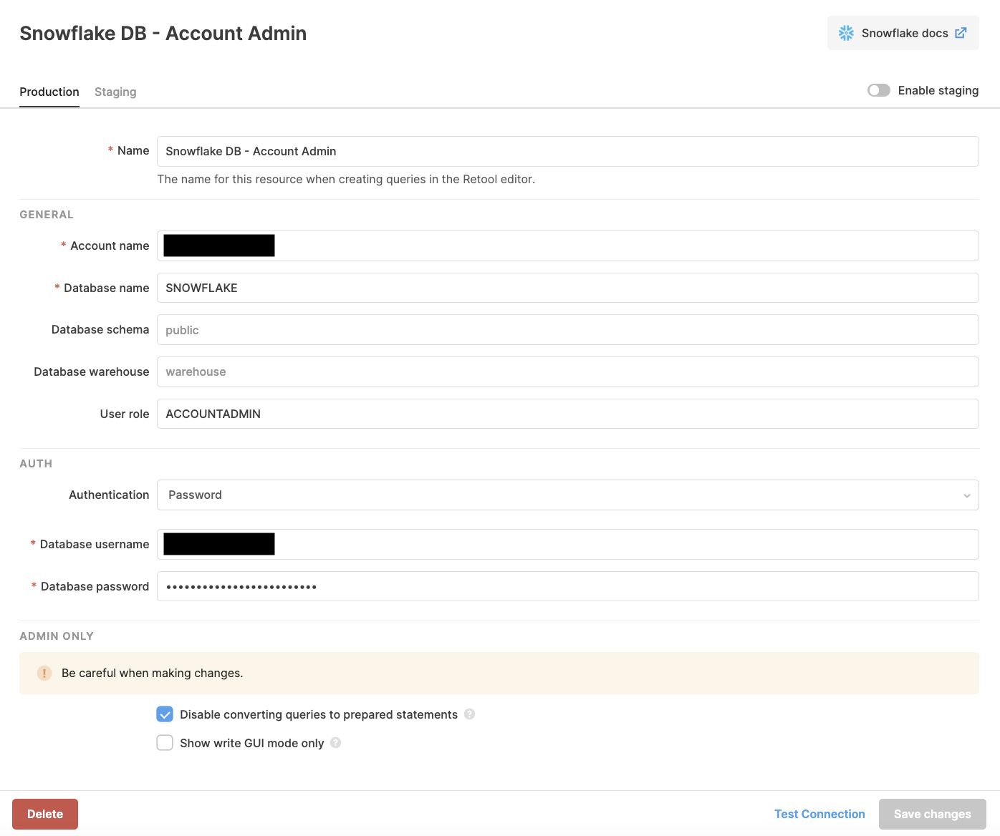

# App Setup - Step 2: Resources in Retool

## What's a Resource in Retool?
A Resource is a core concept in Retool. A Resource is a config that defines a backend data source that your Retool apps can talk to. Retool supports a variety of different kinds of backends, from databases to REST API calls, to special integrations like Stripe.

You can define a Resource once, then use it again and again in your Retool apps.

Read more about Resources in [the Retool docs](https://docs.retool.com/docs/integrations-overview).

## Output
The goal of this section is to create:
* A Resource called `Snowflake DB - Account Admin`. This will be a reusable way to hit Snowflake as the user from Step 1.

Note: The name here is important! The app code we provide expects the Resource to have this name. (You can choose to rename it, after you've finished setting everything up.)

## Step 3.1 - Create the "Snowflake DB - Account Admin" Resource
1. On the Resources page (`/resources`) in Retool, click "Create New" in the upper right.
2. Select the "Snowflake" resource type.
3. Fill out the resource information as follows. (For more info, see [our docs on Snowflake integration](https://docs.retool.com/docs/snowflake-integration).)

```
Name: Snowflake DB - Account Admin

Account name: <your account name>
Database name: SNOWFLAKE
Database schema: [leave blank]
Database warehouse: [leave blank]
User role: ACCOUNTADMIN (this role is required)

Authentication: Password (you must use password authentication)
Database username: <your database username from step 1>
Database password: <your database password from step 1>

[X] Disable converting queries to prepared statements (you must check this box)
```

Note: You must check the 'Disable converting queries to prepared statements' box (see more info [here](https://docs.retool.com/docs/sql-in-retool#prepared-statements)).

4. Click "Save changes".




## Summary
You now have a Snowflake resource defined in Retool, named `Snowflake DB - Account Admin`.

Reminder: The name here is important! The app code we provide expects the Resource to have this name. (You can choose to rename it, after you've finished setting everything up.)

Now, we are ready to import our app!

## Next step
[Step-by-step: Set up Retool App](./set-up-retool-app.md)
