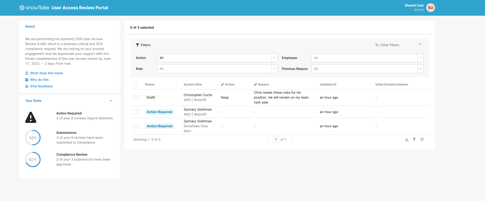
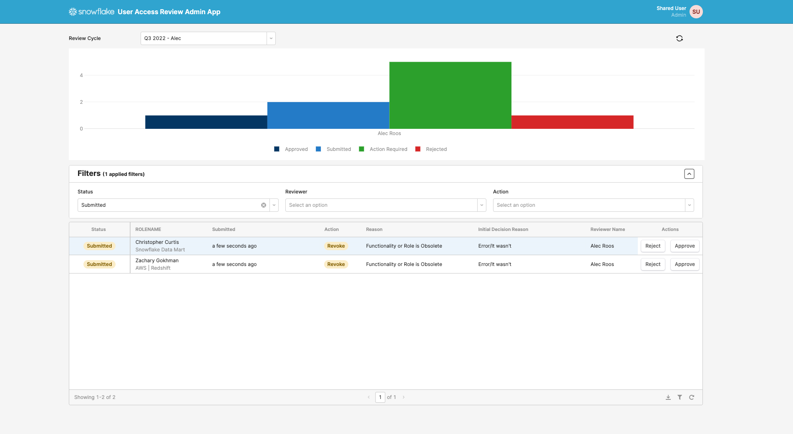
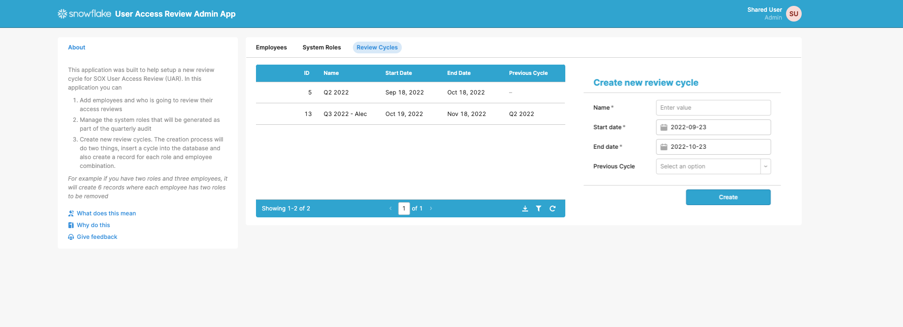
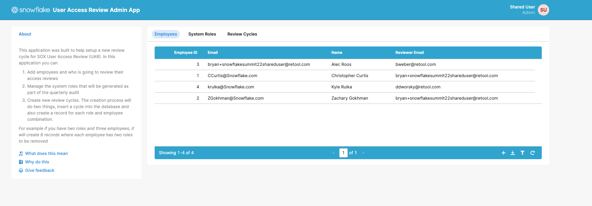
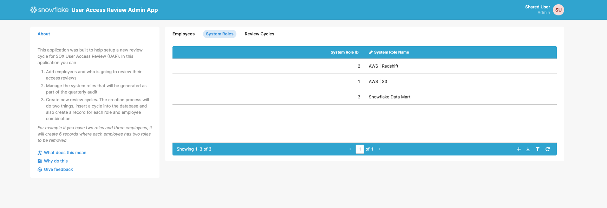

# User Access Reviews by Snowflake

## Why you need this
This Retool app makes it easy to perform periodic reviews of employee access rights. Navigate the process of preparing data, reviewing access rights, and remediating within an easy-to-use GUI. 

## What does the User Access Review app do?
Provides an interface to re-evaluate user roles, access privileges, and credentials to mitigate insider threats, prevent insider mistakes, reduce excessive access, and meet compliance requirements such as HIPAA, FedRAMP, SOX, and more. Take actions such as approving or revoking privileges and enter your reasons for doing so. Submit individual changes or update multiple records in bulk. 

This repo includes all code needed to source user roles within your Snowflake instance and generate the table schemas that the application attaches to. Once you load this application, you have the ability to modify the source code as you need to align to your own organization’s processes. This repo: 

* Provides a schema to use on Snowflake
* Provides a manager review application that implements filtering at the manager level
* An admin application to get started with user and role entry
* A review application to audit manager submissions for super-users and compliance teams

## Caveats
* If you need row-level security reads and writes, talk to your Retool account team
* The template assumes a simple hierarchy (reviewer to employee), however you can customize this by modifying the schema
* These applications are meant to be configurable to meet your needs 
## Screenshots
Manager Review Portal

Compliance Review Portal

Create Review Cycle Admin Application

## Technical Details and Setup
### Dependencies - backends
The Snowflake User Access Roles Review app depends on the following backend services:
- Snowflake

### How to set up Snowflake User Access Roles Review in your Retool instance
See the detailed setup guides in the [Setup Guides folder](./setup-guides).

As an overview, these guides will take you through:

1. Set up Snowflake
[Step-by-step: Set up Snowflake](./setup-guides/set-up-snowflake.md)

2. Set up your Snowflake database as a Resource in Retool
[Step-by-step: Set up Retool Resource](./setup-guides/set-up-retool-resource.md)

3. Set up the Retool app file
[Step-by-step: Set up Retool App](./setup-guides/set-up-retool-app.md)

## How to contribute
Please open a Github Issue on this repo, and let us know about your interest in contributing! We encourage you to reach out before you get started building to get early feedback.
