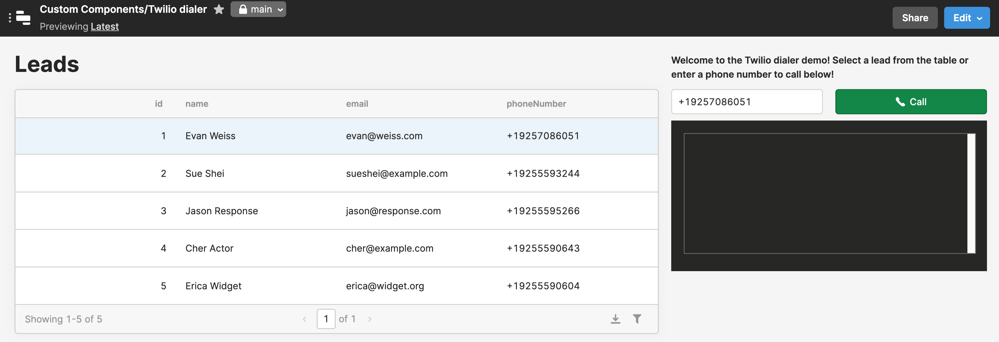

# Twilio Dialer

This app demonstrates how to embed a Twilio dialer in a Retool app. It's a good example of how to use Retool [custom components](https://docs.retool.com/docs/custom-components) to add advanced functionality to your apps!

## Twilio Setup
Before you can get this Retool app working, you'll need to do some pre-work in Twilio.

### 0. Sign up for a Twilio account and get a phone number

If you don't already have a Twilio account, you'll need to get one! The good news is that Twilio makes it easy (and free!) to get started. Just head over to https://www.twilio.com/try-twilio and sign up!

As you go through the onboarding flow, indicate that you'll be building a voice app. Once you're logged into Twilio console, you'll be prompted to get a Twilio phone number. Note the phone number you were assigned for later!

### 1. Create a TwiML App

A [TwiML Application](https://www.twilio.com/docs/usage/api/applications) tells Twilio how to handle the calls you'll make from your Retool app. Specify a name for your TwiML app and note the `TwiML App SID` for later. Leave all other settings blank, we'll fill them in later on!

### 2. Create an API key/secret pair

[Create an API key](https://www.twilio.com/docs/iam/keys/api-key-resource) and note the key's `SID` and `Secret` for later.

### 3. Create a Twilio Service

A [Twilio Service](https://www.twilio.com/docs/runtime/functions/create-service) is a container for the server-less functions which make it possible for your Retool app to get a voice access token, and for outbound calls to be routed correctly.

### 4. Set Twilio Service environment variables

In your new Twilio Service, set the following environment variables:

| Key | Value |
| ---- | ----  |
| `TWIML_APPLICATION_SID` | The `TwiML App SID` you noted in step one |
| `API_KEY` | The `SID` you noted in step two |
| `API_SECRET` | The `Secret` you noted in step two |
| `CALLER_ID` | The phone number you noted in step zero. Make sure to include a `+` and the country code at the beginning! |

### 5. Configure Twilio Service dependencies

The server-less functions running in Twilio need access to a few software libraries to function properly. Import the following NPM modules:

| Module | Version |
| --- | --- |
| `lodash` | `4.17.11` |
| `@twilio/runtime-handler` | `1.2.3` |
| `twilio` | `^3.77.3` |
| `xmldom` | `0.1.27` |
| `util` | `0.11.0` |

### 6. Create a function to issue voice tokens

In order for the embedded Twilio dialer to authenticate with Twilio's services, it needs a valid access token. To create a function for issuing voice tokens:

1. Add a function
2. Specify a path `voice-token`
3. Set the function to `Public`. 
    - **Heads up! This means that anyone who can guess the URL of your function can issue valid access tokens. You would need to implement authentication on this endpoint for a production use-case!**
4. Copy and paste the contents of [voice-token.js](./code/twilio-functions/voice-token.js) into the function and save
5. Copy the URL for this function for later use

### 7. Create a function to route outbound calls

In order for Twilio to know what to do when it receives a call from your app, you need a call routing app. To create a call routing function:

1. Add a function
2. Specify a path `twiml-app`
3. Set the function to `Protected`
4. Copy and past the contents of [twiml-app.js](./code/twilio-functions/twiml-app.js) into the function and save
5. Copy the URL for this function for later use

### 8. Deploy your Twilio Service!

This finalizes all of the changes you've made.

### 9. Finish configuring your TwiML app

Remember that empty TwiML app we created in step one? Edit the app settings and provide the URL for your `twiml-app` function as the value of the **Voice Configuration Request URL**. Specify a **Request Method** of `HTTP POST` and save your changes.

This step connects inbound requests from your Retool app to the call routing function.

## Retool Setup

Now that you've got the Twilio part of this working, it's time to use it in Retool!

### 1. Create a Retool REST API Resource to retrieve voice tokens

In order for your Retool app to authenticate with Twilio, you'll need to get a valid voice token. To set this up:

1. Navigate to the `/resources` page in your instance and click "Create a new resource." 
2. Select REST API as the resource type.
3. Name the resource “Twilio Voice Token.”
4. Specify the URL of your `voice-token` function as noted in step six of the Twilio setup.
5. Specify a header with a key of `identity` and a value of `{{current_user.email}}`. This is used to pass the email address of the Retool user to Twilio for use in the token identity.
6. Save your changes.

### 1. Download the Retool app code

Download [twilio-dialer-retool-app.json](./code/retool/twilio-dialer-retool-app.json) from this repository.

### 2. Import the Retool app code
On the [Retool main page](https://docs.retool.com/docs/protected-applications-getting-started#importing-the-application), click `Create new` and select `Import an app`. Upload the JSON file containing the app code, and name the app.

### 3. Explore the Retool app

If everything is working as expected, you should now be able to place outbound calls from the Retool app! The app is set up with a hardcoded table of "leads" to simulate a simple call center app. You can edit the contents of the leads table directly, or simply type in your phone number in the field to try calling yourself.

### 4. Learn about how the custom component works

You can read more about [Retool custom components](https://docs.retool.com/docs/custom-components). You can also view the code used in the Twilio Dialer component in Retool, the contents of which are included in [retool-custom-component.html](./code/retool/retool-custom-component.html) for easy reading!

Also, take 15 minutes to check out our [video walkthrough](/PLACEHOLDER_DON'T_FORGET_ME!) of how this app is put together!

## How to contribute
Please open a Github Issue on this repo, and let us know about your interest in contributing! We encourage you to reach out before you get started building to get early feedback.
