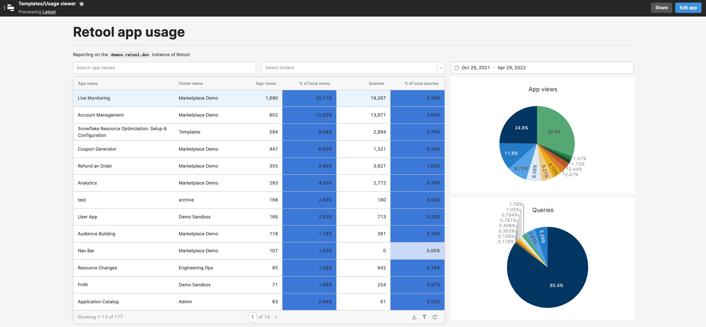

# Retool Usage Viewer - Identify top apps by pageviews and queries

## Why you need this
As an administrator of a self-hosted Retool instance, you want to understand the most frequently used apps in your instance. The Retool audit log contains the information you need, but it's difficult to access and make sense of.

The Retool Usage Viewer makes your job easier by displaying app usage in a way that's easy to consume.

## What does the Usage Viewer do?
Usage Viewer is a ready-made app that lets you do these things:

1. View all applications in your Retool instance, sorted by pageviews or queries
2. Filter by app name, folder, and time range
3. Identify top apps visually using built-in charts

## Screenshot


## Technical details and setup
The Usage Viewer connects to the Postgres instance containing your [Retool storage database](https://docs.retool.com/docs/configuring-retools-storage-database), where a copy of all audit logs are stored. This database is named `hammerhead_production` and is only accessible when self-hosting Retool.

### Create a read-only database user
In order to use the Usage Viewer, first create a Postgres user with **read-only** access to the following tables in the `hammerhead_production` database:

- `pages` (contains information about Retool apps)
- `folders`
- `audit_trail_events`

To create a user and set a password, use the following command:

```
CREATE USER read_only_user WITH PASSWORD 'secure_password';
```

To assign the required permissions, connect to `hammerhead_production` and use the following commands:

```
GRANT CONNECT ON DATABASE hammerhead_production TO read_only_user;
GRANT USAGE ON SCHEMA public TO read_only_user;
GRANT SELECT ON pages TO read_only_user;
GRANT SELECT ON folders TO read_only_user;
GRANT SELECT ON audit_trail_events TO read_only_user;
```

## Create a Postgres resource connection
In the Retool dashboard, [create a new Postgres resource](https://docs.retool.com/docs/postgresql-integration) and provide the necessary connection details.

## Import the Usage Viewer

### 1. Download the app code
Download the app code from the `/code` directory in this repository.

To do this, clone this Github repo: `git clone https://github.com/tryretool/retool-app-exchange.git` 

(Alternatively, you can manually download `usage_viewer.json` from the [`code/`](../code) directory.)

### 2. Import the app code
In the [Retool dashboard](https://docs.retool.com/docs/protected-applications-getting-started#importing-the-application), click `Create new` and select `Import an app`. Upload the JSON file containing the app code, and name the app.

### 3. Test it out
When you load the Usage Viewer in preview mode, you should see a table populated with all of the apps in your Retool instance. Try searching for specific apps, filtering by folder, and adjusting the date range.

## How to contribute
Please open a Github Issue on this repo, and let us know about your interest in contributing! We encourage you to reach out before you get started building to get early feedback.