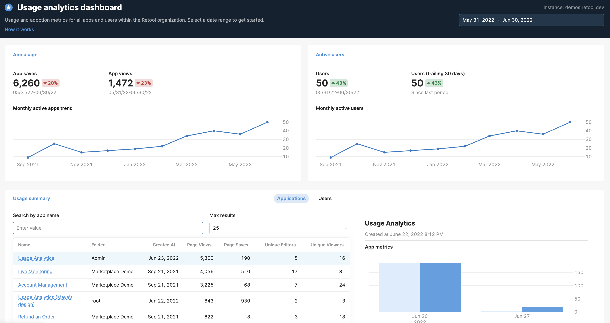

# Importable Usage Analytics Retool App

If you're self-hosting Retool, we’ve created a Retool app you can import to surface usage and adoption metrics for your users and apps.

This data will help you properly allocate developer resources toward app-building and understand how your teams are using Retool. 

**Note**: This app surfaces *directional* usage metrics – not the exact # of users you'll be invoiced for next month.



## Setup
This app needs read access to [Retool's storage database](https://docs.retool.com/docs/configuring-retools-storage-database). Therefore, it's only suitable for use with self-hosted instances of Retool. 

> :warning: **For a smooth app import experience, we recommend upgrading to Retool v2.116 or later.**

### 0. Make sure you have access!

You should have the right approvals and know where to look to find the `POSTGRES_HOST`, `POSTGRES_PORT`, `POSTGRES_DB`, `POSTGRES_USER`, `POSTGRES_PASSWORD` environment variables in your deployment configuration. 

### 1. Create a read-only database user

Since you'll need to connect to Retool's storage database, which contains all your apps, users, and settings, we recommend creating a read-only user, with access to the following tables in the Retool storage database:

- `page_saves`
- `pages`
- `folders`
- `users`
- `audit_trail_events`
- `groups`
- `resources`
- `workflow_save`

To create a user and set a password, use the following command when running `psql` in your `postgres` container.

```CREATE USER <YOUR_READ_ONLY_USER> WITH PASSWORD <YOUR_PASSWORD>;```

To assign the required permissions, connect to the Retool storage database and use the following commands:

```
GRANT CONNECT ON DATABASE `<POSTGRES_DB>` TO <YOUR_READ_ONLY_USER> ;
GRANT USAGE ON SCHEMA public TO <YOUR_READ_ONLY_USER>;
GRANT SELECT ON page_saves TO <YOUR_READ_ONLY_USER>;
GRANT SELECT ON pages TO <YOUR_READ_ONLY_USER>;
GRANT SELECT ON folders TO <YOUR_READ_ONLY_USER>;
GRANT SELECT ON users TO <YOUR_READ_ONLY_USER>;
GRANT SELECT ON audit_trail_events TO <YOUR_READ_ONLY_USER>;
GRANT SELECT ON groups to <YOUR_READ_ONLY_USER>;
GRANT SELECT ON resources to <YOUR_READ_ONLY_USER>;
GRANT SELECT ON groups to <YOUR_READ_ONLY_USER>;
GRANT SELECT ON resources to <YOUR_READ_ONLY_USER>;
GRANT SELECT ON organizations to <YOUR_READ_ONLY_USER>;
GRANT SELECT ON workflow_save to <YOUR_READ_ONLY_USER>;
GRANT SELECT ON workflow to <YOUR_READ_ONLY_USER>;
GRANT SELECT ON workflow_run to <YOUR_READ_ONLY_USER>;
```

## 2. Connect the Retool Postgres DB as a Resource

1. Navigate to the `/resources` page in your instance and click "Create a new resource" 
2. Select Postgres as the resource type
3. Name the resource “Retool Audit Log”
4. To fill out the following details, depending on your deployment, check your secrets file in your deployment configuration. The relevant environment variables are:
    - Host: `POSTGRES_HOST`
    - Port: `POSTGRES_PORT`
    - Database name: `POSTGRES_DB`
    - Database username: `<read_only_user>`
    - Database password: `<your_password>`

Save the resource, and it should be available for use by your apps. 

**Note**: If you have multiple instances, you’ll have a Postgres DB for each instance, which means you can only view usage analytics for that instance only. 

### 3. Download the app code
Download the app code from the `/code` directory in this repository.

To do this, clone this Github repo: `git clone https://github.com/tryretool/retool-app-exchange.git` 

(Alternatively, you can manually download `usage_analytics.json` from the [`code/`](../code) directory.)

### 4. Import the app code
On the [Retool main page](https://docs.retool.com/docs/protected-applications-getting-started#importing-the-application), click `Create new` and select `Import an app`. Upload the JSON file containing the app code, and name the app.

### 5. Rewire the Resource for each query 
If the Usage Analytics app doesn't populate with data, it's likely you'll need to update the Resource for each query. 

To update the queries to use the correct Resource, load the Usage Analytics app in editor mode and open the bottom panel to view the queries. Edit each query and select your Retool Postgres database from the Resource dropdown. (Don't forget to save your queries after editing them!)

## How to contribute
Please open a Github Issue on this repo, and let us know about your interest in contributing! We encourage you to reach out before you get started building to get early feedback.
